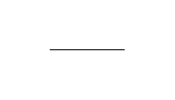
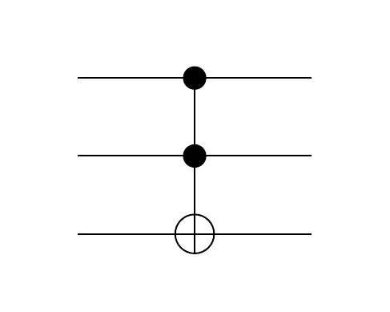
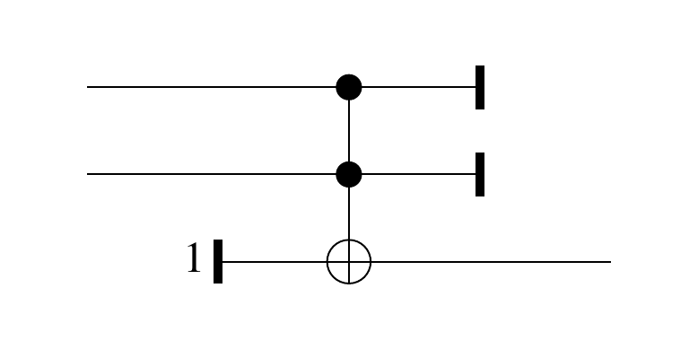
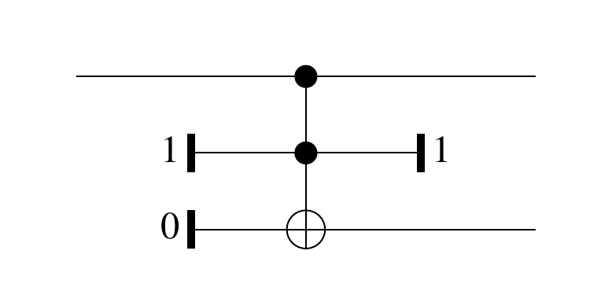
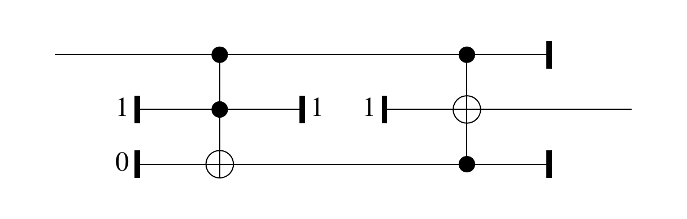
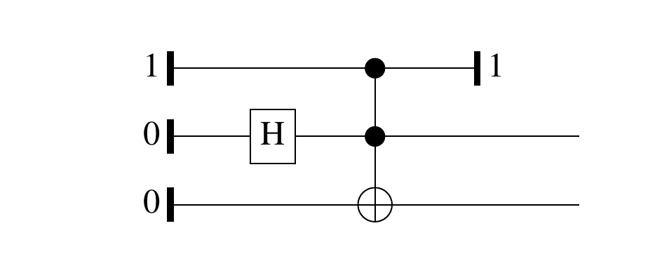
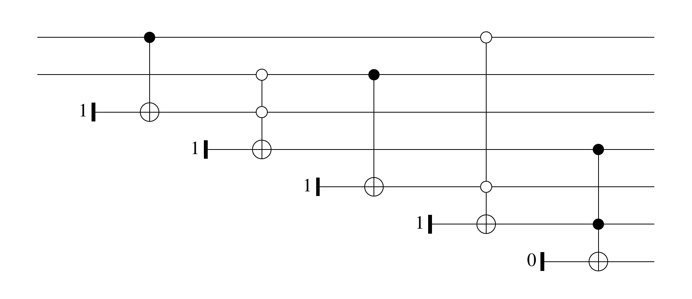
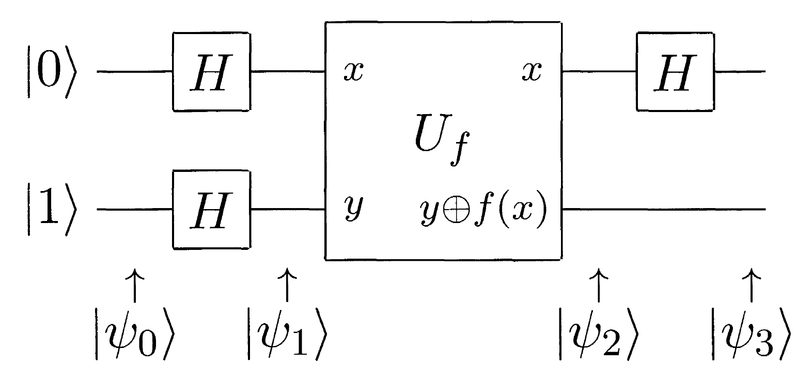

## Instalación

<div style="font-size:1.2em">
[`mx-psi.github.io/libreim-quantum`](https://mx-psi.github.io/libreim-quantum)
</div>

. . .

1. Instalar [`stack`](https://docs.haskellstack.org/en/stable/README/),
2. clonar [`mx-psi/libreim-quantum`](https://github.com/mx-psi/libreim-quantum) y 
3. ejecutar `stack build`

# Computación clásica

## El espacio de estados

Un ordenador clásico hace cálculos con símbolos.

:::{.example}
Un **bit** es un elemento del espacio de estados $\mathbb{B} := \{0,1\}$.
:::

Podemos manipular un estado con varios bits.

Con $n$ bits, el espacio de estados es $\mathbb{B}^n$.

<aside class="notes">
- Explicar $\mathbb{B}^n$.
- Podemos trabajar con más de dos símbolos
- Codificamos los problemas de la forma usual
</aside>

## Puertas clásicas

:::{.definition}
Una **puerta clásica** es una función $f: \mathbb{B}^n \to \mathbb{B}^m$.

- $n$ es el número de **entradas** y
- $m$ es el número de **salidas**.
:::


:::{.example}
$$\operatorname{NAND}(x,y) = \operatorname{NOT}(\operatorname{AND}(x,y))$$
:::

## Otras puertas

:::{.definition}
**FANOUT**: 1 entrada y 2 salidas,
$$\operatorname{FANOUT}(x) = (x,x).$$

**ANCILLA**$_x$: 0 entradas y 1 salida,
$$\operatorname{ANCILLA}_x(\varepsilon) = x.$$

**DESCARTA**: 1 entrada y 0 salidas,
$$\operatorname{DESCARTA}(x) = \varepsilon.$$
:::

## Circuitos

:::{.definition}
Un *circuito* es un grafo dirigido acíclico etiquetado

- cada nodo es entrada, salida o una puerta,
- entradas y salidas se asocian con un vértice cada una.
- el grado de entrada y salida de un vértice coincide con el de su etiqueta.
:::

. . .

- Tiene una función $C:\mathbb{B}^n \to \mathbb{B}^m$ asociada.

- $|C|$ es su número de nodos.

<aside class="notes">
Específicamente,

1. si $v \in V$ es una puerta $f: \mathbb{B}^n \to \mathbb{B}^m$ entonces $\operatorname{deg}_{\operatorname{in}}(v) = n$ y $\operatorname{deg}_{\operatorname{out}}(v) = m$
2. si $v \in V$ es una entrada, $\operatorname{deg}_{\operatorname{in}}(v) = 0$ y $\operatorname{deg}_{\operatorname{out}}(v) = 1$,
3. si $v \in V$ es una salida, $\operatorname{deg}_{\operatorname{in}}(v) = 1$ y $\operatorname{deg}_{\operatorname{out}}(v) = 0$.

- En principio las funciones asociadas a las puertas podrían no ser simétricas y habría que añadir también una ordenación de las aristas que inciden en cada puerta (omitimos esto en la definición)
- Podemos medir aparte del tamaño, la «profundidad», que sirve para el paralelismo.
</aside>

## Conjunto universal

:::{.definition}
$\mathcal{B}$ es *universal* si toda función es la función asociada a un circuito con puertas en $\mathcal{B}$.
:::

. . .

:::{.example}
$\mathcal{B} = \{\operatorname{OR},\operatorname{AND},\operatorname{FANOUT}\}$ **no** es universal
:::

. . .

:::{.example}
$\mathcal{B} = \{\operatorname{NAND},\operatorname{FANOUT}\}$ es universal.
:::


<aside class="notes">
- Los circuitos respecto de esa base se llaman *monótonos*. No pueden calcular NOT.
- La clase $\mathsf{AC}^0$ se define a partir de circuitos monótonos; algunos teoremas relativizados pueden transformarse en teoremas no relativizados de esta clase.
- La clasificación completa de las posibles bases viene dada por el retículo de Post.
</asides>

## Reversibilidad

:::{.definition}
La puerta *Toffoli* se define $$\operatorname{TOFFOLI}(x,y,z) = (x,y,z \oplus (x \cdot y))$$
:::

:::{.proposition}
$\{\operatorname{TOFFOLI}, \operatorname{ANCILLA}_{x}, \operatorname{DESCARTA}\}$  es universal.
:::

<aside class="notes">
- $\oplus$ es la operación XOR
- La puerta de Toffoli es reversible!
</aside>

## Familias de circuitos

Cuando necesitamos tener una entrada de tamaño arbitrario, consideramos una familia de circuitos $\mathcal{C} = \{C_n\}_{n \in \mathbb{N}}$, tal que $C_n$ tiene $n$ entradas.

Su función asociada es $\mathcal{C}(x) = C_{|x|}(x)$.

Es *uniforme* si la función $n \mapsto C_n$ es computable.

<aside class="notes">
- Su tamaño es la función $t(n) = |C_n|$.
- El objetivo de la complejidad clasica es medir el número de puertas necesarias para calcular una función (por ejemplo, que resuelva un problema de decisión)
- Sin uniformidad podemos definir una sucesión que resuelva un problema indecidible (!).
- Un lenguaje está en $\mathsf{P}$ si existe una familia uniforme de circuitos de tamaño polinomial que calcula $1_L$.
</aside>

# Computación probabilística

## El espacio de estados

Con aleatoriedad, el estado será una distribución sobre $\mathbb{B}$.

:::{.example}
Un bit aleatorio es un vector con norma 1 de un espacio vectorial real $R$ con base $\{| 0 \rangle, | 1 \rangle\}$,
$$a |0\rangle + b |1 \rangle,\qquad a + b = 1, a,b \geq 0$$
:::

Si tenemos $n$ bits aleatorios, el espacio de estados es $R^{\otimes n}$.

<aside class="notes">
- $a$ y $b$ serán sus probabilidades.
- Explicar producto tensorial.
- Podemos ver la formación del espacio de estados compuesto como aplicar el producto de una categoria monoidal a un espacio de estados base.
- El objeto unidad de la categoría sirve como $R^{\otimes 0}$.
</aside>

## Puertas probabilísticas

:::{.definition}
Una *puerta* es una aplicación lineal $f: R^{\otimes n} \to R^{\otimes m}$ que lleva vectores de norma 1 en vectores de norma 1.

Viene dada por una matriz estocástica.
:::

:::{.example}
$$\operatorname{RANDOM}(v) = \frac12\begin{pmatrix}1 & 1 \\ 1 & 1\end{pmatrix}v$$
:::

<aside class="notes">
- RANDOM ignora su entrada y devuelve una salida aleatoria.
- Podemos hacer una puerta con cero entradas.

- **(!)**: Un circuito se define exactamente igual
</aside>

## Circuitos

La definición de circuito es análoga al caso clásico.

Para calcular la función asociada a un circuito:

1. escogemos un orden topológico de las puertas,
2. extendemos a la dimensión adecuada y
3. componemos en orden inverso.

. . .

La función es invariante al orden topológico ya que
$$(f \otimes g) \circ (h \otimes s) = (f \circ h) \otimes (g \circ s).$$

<aside class="notes">
- Hacer ejemplo en pizarra.
- Explicar producto de Kronecker.
- Un buen ejemplo es random(0.1,0.9) → fanout → not en un cable y nada en el otro.
- La independencia del orden topológico se sigue de la identidad
</aside>

## Clásica a probabilística

Toda puerta clásica tiene una probabilística asociada: su extensión lineal.
Su matriz es una matriz de permutación.

Nos restringimos a circuitos formados por
$$\{\operatorname{NAND}, \operatorname{FANOUT}, \operatorname{RANDOM}\}.$$

<aside class="notes">
En principio los circuitos con matrices estocásticas arbitrarias podrían permitirnos calcular funciones no computables, codificando en la probabilidad la información no computable.
</aside>

## Medición y error

La salida de un circuito probabilístico será un vector de probabilidades que muestreamos.

.  . .

:::{.definition}
$C: R^{\otimes n} \to R^{\otimes m}$ calcula $f: \mathbb{B}^n \to \mathbb{B}^m$ si
$$P[C(x) = f(x)] \geq \frac23$$
:::

<aside class="notes">
- El vector de probabilidades tendrá longitud $2^n$.
- Estamos usando implícitamente que llevamos $i: \mathbb{B}^n \to R^{\otimes n}$
</aside>

# Computación cuántica

## El espacio de estados

El espacio de estados es un espacio de Hilbert separable complejo.

:::{.example}
Un **qubit** es un vector unitario de un espacio vectorial complejo con base ortonormal $\{|0\rangle,|1\rangle\}$,
$$|\psi\rangle = \alpha |0\rangle + \beta |1\rangle, \qquad |\alpha|^2 + |\beta|^2 = 1$$
$\alpha$ y $\beta$ son las **amplitudes** de $|\psi\rangle$.
:::

Con $n$ qubits, el espacio de estados es $Q^{\otimes n}$.

<aside class="notes">
- Explicar qué es un espacio de Hilbert (y que en el caso finito pueden pensar simplemente en que tiene un producto escalar).
- Escribir base $$|00\rangle, |01\rangle, |10\rangle, |11\rangle$$
- Realmente estamos trabajando con el proyectivo.
- En información cuántica se suele trabajar con estados mixtos que representan distribuciones sobre los vectores unitarios.
</asides>

## ¿Qué es una puerta cuántica?

Una puerta cuántica es una aplicación unitaria $U: Q^{\otimes n} \to Q^{\otimes n}$.

:::{.example}
La puerta de Hadamard se define
$$H|x\rangle = \frac{1}{\sqrt{2}}(|0\rangle + (-1)^x|1\rangle)$$ 
:::

:::{.proposition}
Hay conjuntos «universales» y finitos de puertas que aproximan cualquier otra puerta.
:::

<aside class="notes">
- Unitaria significa que respeta el producto escalar o que su inversa sea su transpuesta conjugada.
- Que respete el producto escalar significa que respeta la norma 2, luego es equivalente en cierto sentido a las matrices estocásticas que veíamos antes.
- Un circuito se define, de nuevo, exactamente igual y su función asociada se computa exactamente igual.
- El teorema de Solovay-Kitaev nos dice que cualquier conjunto que genere un conjunto denso lo hace de forma «rápida».
- En términos de computabilidad no hay diferencia (podemos hacer simulaciones exponenciales). Con cuaterniones sale igual!
</aside>

## Medición

La salida de un circuito cuántico será un vector unitario.
Si medimos 
$$|\psi\rangle = \sum_{i = 0}^{2^n-1} \alpha_i|i\rangle$$ 
tenemos
$$P(\operatorname{Meas}|\psi\rangle = i) = |\alpha_i|^2$$

<aside class="notes">
- Podemos medir de otras formas que no comentamos aquí; nos basta con esta.
- La calculabilidad se define igual que en el caso probabilístico.
</aside>

## Puertas clásicas

Cualquier puerta clásica reversible es unitaria y podemos simular aleatoriedad con la puerta de Hadamard.

Llevamos una función $f:\mathbb{B}^n \to \mathbb{B}^m$ a otra $$(x,y) \mapsto (x, y \oplus f(x)).$$

<aside class="notes">
- No hay clonación! Sólo FANOUT.
- Vemos las implementaciones concretas en Quipper.
</aside>

# Quipper


## El lenguaje

Quipper es un lenguaje embebido en Haskell que permite definir familias uniformes de circuitos.

Distinguimos 3 etapas 

1. tiempo de compilación,
2. tiempo de generación de circuitos y
3. tiempo de ejecución de circuitos.

## Tipos

Quipper trata con 3 tipos de datos

`Bool`
: Tipo de los **parámetros** (se conocen en tiempo de generación)

`Bit` y `Qubit`
: Tipo de **entradas** clásicas y cuánticas (se conocen en tiempo de ejecución).

Todas las operaciones ocurren en una mónada `Circ`.

<aside class="notes">
Podemos convertir un parámetro a una entrada con `qinit  :: Bool -> Circ Qubit`.
</aside>

***
Vamos a definir el circuito más básico posible: un cable.
Lo hacemos con notación `do`.

::::{.twocol}
:::{}
```haskell
wire :: Qubit -> Circ Qubit
wire x = do
  pure x
```
<span style="font-size:0.5em">[Clasical.hs](https://github.com/mx-psi/libreim-quantum/blob/master/diagrams/Classical.hs)</span>
:::
:::{}

:::
::::

## Operaciones básicas

Podemos usar las operaciones básicas.

::::{.twocol}
:::{}
```haskell
toffoli :: (Qubit,Qubit,Qubit) 
   -> Circ (Qubit,Qubit,Qubit)
qinit :: Bool -> Circ Qubit
qdiscard :: Qubit -> Circ ()
```
:::
:::{}

:::
::::

## Puertas clásicas

Por ejemplo, podemos definir `nand` utilizando estas operaciones

::::{.twocol}
:::{}
```haskell
nand :: (Qubit,Qubit) -> Circ Qubit
nand (x,y) = do
  z  <- qinit True
  (x,y,z) <- toffoli (x,y,z)
  qdiscard (x,y)
  pure z
```
<span style="font-size:0.5em">[Classical.hs](https://github.com/mx-psi/libreim-quantum/blob/master/diagrams/Classical.hs)</span>
:::
:::{}

:::
::::

***

Y la puerta `fanout`

::::{.twocol}
:::{}
```haskell
fanout :: Qubit -> Circ (Qubit, Qubit)
fanout x = do
  y  <- qinit True
  z  <- qinit False
  (x,y,z) <- toffoli (x,y,z)
  qdiscard y
  pure (x, z)
```
<span style="font-size:0.5em">[Classical.hs](https://github.com/mx-psi/libreim-quantum/blob/master/diagrams/Classical.hs)</span>
:::
:::{}

:::
::::

***
Y combinarlas por ejemplo para definir la puerta `not`.

::::{.twocol}
:::{}
```haskell
notCirc :: Qubit -> Circ Qubit
notCirc x = do
  (x,x') <- fanout x
  y <- nand (x,x')
  pure y
```
<span style="font-size:0.5em">[Classical.hs](https://github.com/mx-psi/libreim-quantum/blob/master/diagrams/Classical.hs)</span>
:::
:::{}

:::
::::

## Entrelazamiento

::::{.twocol}
:::{}
```haskell
bellPair :: Circ (Qubit, Qubit)
bellPair = do
  (x, y, z) <- qinit (True, False, False)
  hadamard y
  toffoli (x, y, z)
  qterm True x
  pure (y, z)
```
:::
:::{}

:::
::::

<aside class="notes">
- Vemos aquí el estilo imperativo, que también es posible.
- Creamos una pareja entrelazada.
- Es un ejemplo de circuito sin entradas
- Podemos ejecutarlo en `diagrams`.
</aside>

## Generación de circuitos

Podemos generar circuitos automáticamente a partir de funciones booleanas.

:::::{.twocol}
:::{}
```haskell
build_circuit
boolean_xnor (x,y) = 
  (not x || y) &&  (x || not y)

xnor :: (Qubit,Qubit) -> Circ Qubit
xnor = unpack template_boolean_xnor
```
<span style="font-size:0.5em">[Classical.hs](https://github.com/mx-psi/libreim-quantum/blob/master/diagrams/Classical.hs)</span>
:::
:::{}

:::
:::::

<aside class="notes">
- Los puntos blancos son porque negamos a ambos lados para cambiar la condición sobre la que condicionamos
- También podemos hacer operaciones con circuitos como revertirlos o cambiar la base universal.
</aside>

## El algoritmo de Deutsch



***

```haskell
deutsch :: ((Qubit,Qubit) -> Circ (Qubit,Qubit)) -> Circ Bit
deutsch oracle = do
  (x,y) <- qinit (False,True)
  (x,y) <- map_hadamard (x,y)
  (x,y) <- oracle (x,y)
  x <- map_hadamard x
  z <- measure x
  qdiscard y
  pure z
```
<span style="font-size:0.5em">[Deutsch.hs](https://github.com/mx-psi/libreim-quantum/blob/master/deutsch/Deutsch.hs)</span>

## `QShape`

La clase de tipos `QShape` generaliza

```haskell
instance QShape Bool Bit Qubit where 
...

instance QShape ba ca qa => QShape [ba] [ca] [qa] where
...
```


## El algoritmo de Deutsch-Jozsa

```haskell
data Oracle qa = Oracle {
  shape   :: qa,
  circuit :: (qa,Qubit) -> Circ (qa,Qubit)
  }
```
<span style="font-size:0.5em">[Oracle.hs](https://github.com/mx-psi/libreim-quantum/blob/master/src/Oracle.hs)</span>

****

```haskell
deutschJozsa :: (QShape ba qa ca) => Oracle qa -> Circ ca
deutschJozsa oracle = do
  (x, y) <- qinit $ (qc_false (shape oracle), True)
  (x, y) <- map_hadamard (x, y)
  (x, y) <- boxedOracle (x, y)
  x      <- map_hadamard x
  z      <- measure x
  qdiscard y
  pure z
```
<span style="font-size:0.5em">[Deutsch.hs](https://github.com/mx-psi/libreim-quantum/blob/master/deutsch/Deutsch.hs)</span>

# Fin

## Referencias

- [*Quantum Computation and Quantum Information*](http://mmrc.amss.cas.cn/tlb/201702/W020170224608149940643.pdf) - Nielsen & Chuang
- [*One Complexity Theorist’s View of Quantum Computing*](https://people.cs.uchicago.edu/~fortnow/papers/quantview.pdf) - Fortnow
- [*Quantum Computational Complexity*](https://arxiv.org/pdf/0804.3401.pdf) - Watrous
- [*An Introduction to Quantum Programming in Quipper*](https://arxiv.org/abs/1304.5485) - Green et al.
